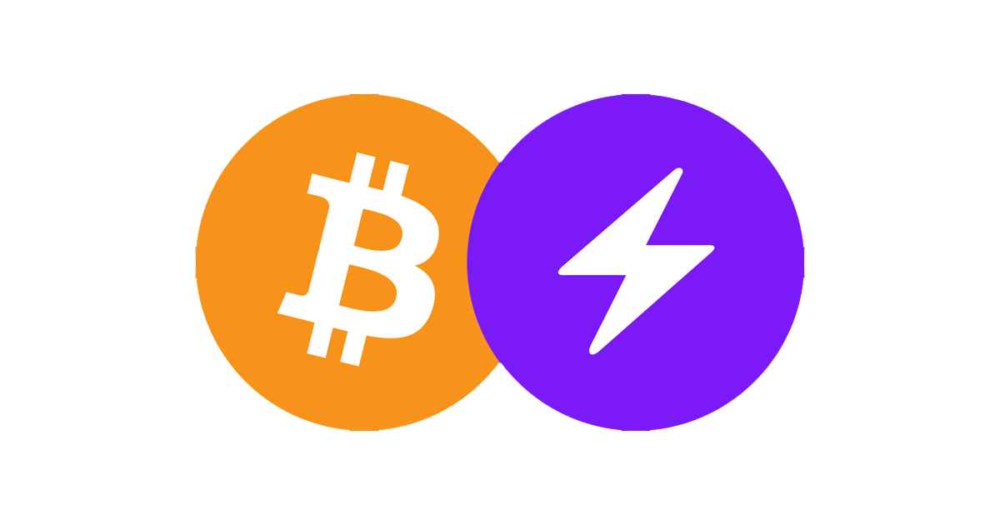

# Bitcoin-and-Lightning-tutorial

## Contents
- [Bitcoin Core Tutorial](bitcoin_on_regtest_tutorial.md)
- [LND Tutorial](LND_on_regtest_tutorial.md)
- [Core-lightning Tutorial](CLN_on_regtest_tutorial.md)

## My Blogs
- [Decoding the Bitcoin White-paper: A Simple Explanation](https://medium.com/@nishant_bansal/decoding-the-bitcoin-white-paper-a-simple-explanation-e748d0a6fd19)
- [Exploring the Bitcoin Lightning Network: The Future of Scalable Transactions](https://medium.com/@nishant_bansal/exploring-the-bitcoin-lightning-network-the-future-of-scalable-transactions-ccdc1acf2aac)

## Additional
- In bitcoind transactions, peering is irrelevant to the sender and receiver; transactions rely on the broader network.
- In the Lightning Network, peering depends on whether a direct channel is used:

	- Direct channel → Requires peering.
	- Routed payment → Peering not required; intermediaries can handle routing.

If you aim to use the Lightning Network efficiently, establishing well-connected channels or relying on good routing nodes is more important than direct peering with every counterparty.

### Info
The behavior you're observing in Node 2 is likely because you used the connect option instead of addnode. Here's how connect affects the output compared to addnode.

### Difference Between connect and addnode
connect:

Forces the node to connect only to the specified peer(s).
It does not allow connections to other peers unless explicitly specified.
If the connection is successful, it will always show connected: true for the specified node.
addnode:

Adds a node to the list of peers to try connecting to.
The node will attempt to connect to the specified peer but may also connect to other peers discovered through the P2P network.
connected will show false if the connection fails or the peer is unreachable.
Why Node 2 Shows connected: true
When you use connect in Node 2's configuration:

Node 2 attempts to connect directly to 127.0.0.1:8333 (Node 1) and succeeds.
This results in the connected: true status, with the connection marked as outbound.
The connect option forces this behavior by prioritizing the connection to the specified node.
Why Node 1 Shows connected: false
Node 1 likely used addnode or had no explicit connection directive:

The added nodes (127.0.0.1:18445 and 127.0.0.1:8334) are unreachable, so the connection fails.
If you used connect for Node 1 instead, it would have shown connected: true for any reachable peer.

### **Differences from Other Options**
| **Option**      | **Behavior**                                                                                 |
|------------------|---------------------------------------------------------------------------------------------|
| **`addnode`**    | Adds the peer(s) to the list of nodes to connect to, but does not restrict other connections. |
| **`connect`**    | Restricts the node to connect only to the specified peer(s).                                 |
| **`seednode`**   | Similar to `addnode`, but only for initial bootstrapping. The connection is dropped after peer discovery. |
